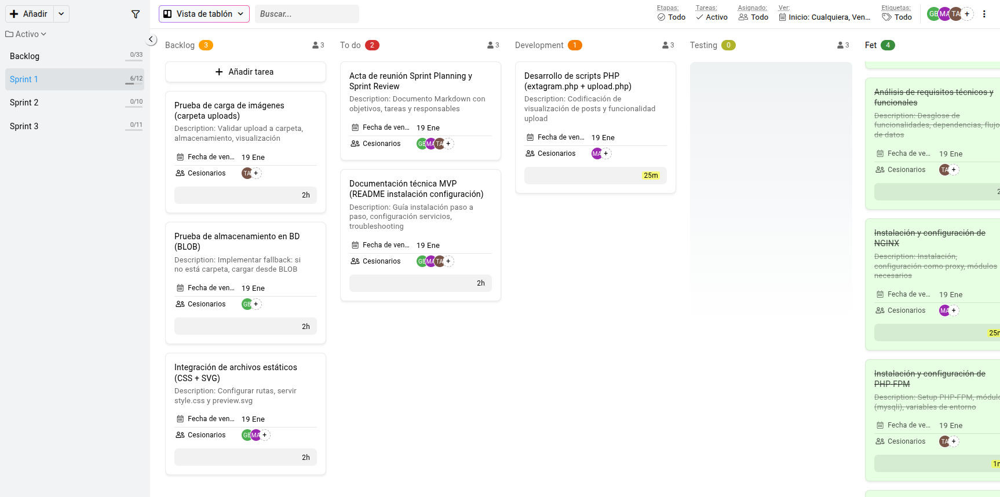
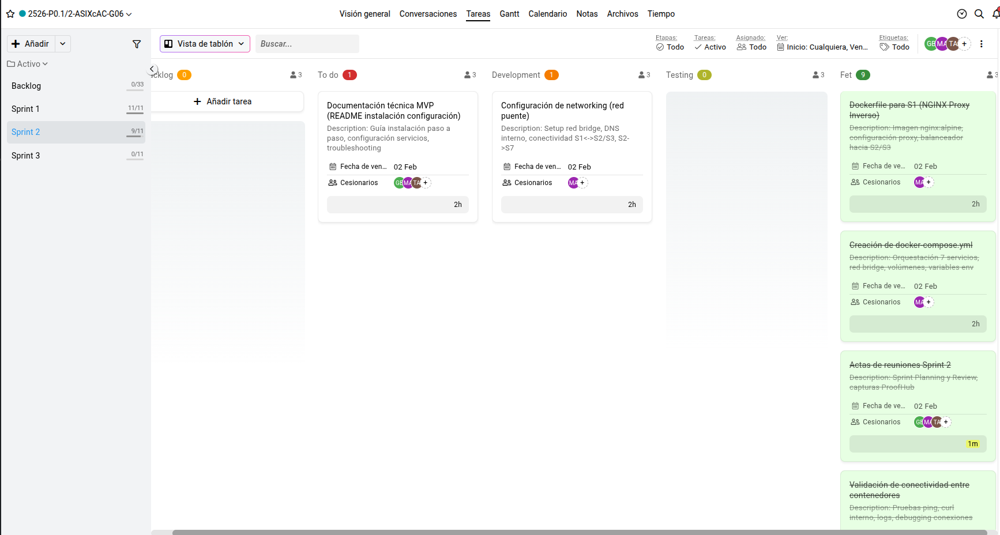

# Acta Sprint 1 Review - 19/01/2026

**Fecha y hora:** Lunes, 19 de enero de 2026, a las 16:17 CET

**Miembros en la reunion:** Manuel Amaya, Adrian Tamargo y Guim Ballve

## Plan inicial del equipo
Teníamos pensado retomar lo que dejamos antes de las vacaciones, desplegando y configurando los servicios en la nube según el plan de los sprints del proyecto P0.1.

## Feedback y problemas
Tuvimos la mala suerte de perder la cuenta principal del creador del repositorio, impidiéndonos agregarnos nuevamente (ni con nueva cuenta), ya que un miembro no se había añadido por precaución y el otro no tenía permisos. Además, la creación de la máquina daba problemas con la conexión SSH (descarga mal del .pem y errores extraños). Aparte, la clase anterior a esta era la primera en la que estábamos todos los miembros del grupo.

## Decisión final del equipo
Se ha solucionado todo: nuevo GitHub clonado, acceso restaurado y SSH arreglado; ya hemos podido configurar. Todo lo que nos queda se dejará para el siguiente sprint, para avanzar en los sprints sin más interrupciones.

---

# Acta Sprint 2 Review - 02/02/2026

**Fecha y hora:** Lunes, 02 de febrero de 2026, a las 16:57 CET

**Miembros en la reunion:** Manuel Amaya y Guim Ballve

## Plan inicial del equipo
Tener la web funcionando una vez hecha la dockerización.

## Feedback y problemas
Una vez más se nos complicaron las cosas con la pérdida de un miembro, lo que ocasionó que nos retrasáramos un poco con las fechas de cada tarea y la reorganización de estas.

Tuvimos muchos problemas de código, sobre todo con el S1 y S4; también el tema de las rutas de los ficheros nos fallaba, nada que no pudiéramos arreglar.

## Decisión final del equipo
Se pudo reorganizar el Proofhub de forma correcta, pudimos iniciar la web (aún con algunos problemas) y después hacerla funcional y, sobre todo, pudimos adaptarnos a las circunstancias sin atrasar mucho el proyecto.

---

# Acta Sprint 3 Review - 10/02/2026

**Fecha y hora:** Lunes, 10 de febrero de 2026, a las 16:49 CET

**Miembros en la reunion:** Manuel Amaya y Guim Ballve

## Plan inicial del equipo
Mejorar aquellas tareas pendientes de la web.

## Feedback y problemas
Tuvimos muchos problemas de código, en específico con **extagram.php** y **upload.php**, ya que no cargaban las imágenes correctamente: a veces cargaba alguna, otras veces no. Una vez arreglado eso, surgió un nuevo problema con la subida de contenido.

Las subidas se hacían correctamente y se almacenaban tanto en la base de datos como en los archivos correspondientes, pero la web no llamaba las imágenes, por lo que no las mostraba. Esto, aunque con dificultad, pudimos arreglarlo el último día, haciendo la web funcional.

Solo nos quedó la parte de documentación, ya que aún quedaban cosas por documentar en GitHub.

## Decisión final del equipo
Prepararse para el **Proyecto 0.2** y terminar la documentación de GitHub.

